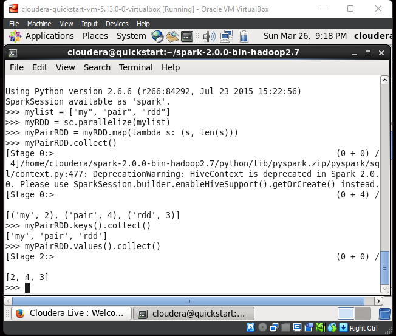

## Nama      : Muhammad Hamamiy Zadah
## Kelas     : TI - 3C
## No. Absen : 12

Menjalankan service dari pyspark terlebih dahulu dengan perintah
kemudian masuk pada directori spark2.0.0 dengan perintah

cd spark-2.0.0-bin-hadoop2.7

kemudian service dari pyspark dengan perintah

bin/pyspark

### Accumulator.py

Hasil : Berhasil. Fungsi accumulator (bertujuan akumulasi shared variable) berhasil dijalankan dengan output "4950".

- SparkContext, disingkat menjadi "sc", adalah objek utama yang digunakan dalam pemrograman dengan Apache Spark. Dengan menggunakan SparkContext, kita dapat menginisialisasi aplikasi Spark dan membuat RDD (Resilient Distributed Datasets) yang mendukung komputasi paralel.

- Accumulator adalah objek shared variable yang digunakan dalam Apache Spark untuk mengumpulkan nilai secara asinkron dari beberapa executor (pekerja) di sepanjang sebuah job (tugas). Objek ini biasanya digunakan untuk menghitung statistik yang kompleks atau mengakumulasikan hasil dalam loop.

- Parallelize adalah sebuah method yang digunakan pada objek SparkContext untuk membuat RDD dari koleksi data yang ada dalam program. RDD ini akan didistribusikan secara paralel pada executor (pekerja) yang tersedia.

- Lambda adalah sebuah fungsi anonim yang sering digunakan dalam pemrograman fungsional dan pemrograman paralel. Fungsi ini biasanya digunakan untuk melakukan operasi yang sederhana dan terbatas pada sebuah data, sehingga sangat cocok untuk dijalankan di dalam RDD.

- Value adalah nilai dari suatu variabel bisa berupa Integer, String, DLL

### BroadCast.py

Hasil : Berhasil. Fungsi Broadcast (Membuat variabel broadcast) sesuai range dan untuk mengakses nilai matriks / array menggunakan atribut broadcastVar.value

- Broadcast adalah sebuah fungsi dalam Spark yang memungkinkan pengguna untuk mendistribusikan variabel secara efisien ke setiap node dalam sebuah cluster. Dengan menggunakan broadcast, setiap node dapat mengakses variabel tersebut dengan cepat tanpa perlu menyalinnya berkali-kali.

- List adalah tipe data yang umum digunakan dalam bahasa pemrograman Python untuk menyimpan sejumlah nilai dalam satu variabel. List dapat berisi elemen-elemen dengan tipe data yang berbeda, dan dapat diakses menggunakan indeks. List ini sangat berguna dalam berbagai macam aplikasi dan dapat dimanipulasi dengan mudah menggunakan fungsi-fungsi built-in di Python.

- Range adalah sebuah fungsi dalam bahasa pemrograman Python yang digunakan untuk menghasilkan deret bilangan bulat secara berurutan. Fungsi ini dapat diberikan argumen untuk memulai, mengakhiri, dan menentukan langkah antar bilangan. Deret bilangan ini sering digunakan dalam skenario pemrograman seperti pengulangan for-loop, dan sangat efisien untuk digunakan dalam program yang membutuhkan kumpulan bilangan bulat berurutan.

### LogAnalytics.py

- textFile: textFile adalah sebuah fungsi dalam Spark yang digunakan untuk membaca file teks dan mengembalikan RDD (Resilient Distributed Datasets) yang berisi baris-baris dalam file tersebut sebagai elemen-elemennya.

- filter: filter adalah sebuah fungsi dalam Spark yang digunakan untuk memfilter elemen-elemen dalam RDD berdasarkan kondisi tertentu. Fungsi ini mengembalikan RDD yang hanya berisi elemen-elemen yang memenuhi kondisi tersebut.

- cache: cache adalah sebuah metode dalam Spark yang digunakan untuk menyimpan RDD di dalam memori cache. Hal ini dapat meningkatkan performa komputasi karena RDD yang sering digunakan dapat diakses dengan lebih cepat daripada membacanya dari disk.

- count: count adalah sebuah fungsi dalam Spark yang digunakan untuk menghitung jumlah elemen dalam sebuah RDD dan mengembalikan hasilnya sebagai bilangan bulat.

### PaiRDD.py

Hasil : Berhasil. fungsi dasar dari sebuah collection.

method maps digunakan untuk mapping sebuah collection

key: variabel myList 

value: jumlah huruf dari tiap" kata variabel myList
myPairRDD.collect(): print collection
myPairRDD.keys().collect(): print key pada collection
myPairRDD.values().collect(): print values pada collection

- map: map adalah sebuah fungsi dalam Spark yang digunakan untuk melakukan transformasi pada setiap elemen dalam RDD dengan menggunakan sebuah fungsi yang diberikan sebagai argumen. Fungsi ini mengembalikan RDD baru yang berisi hasil transformasi tersebut.

- collect: collect adalah sebuah fungsi dalam Spark yang digunakan untuk mengambil semua elemen dalam sebuah RDD dan mengembalikan hasilnya sebagai list pada driver program. Fungsi ini tidak disarankan digunakan pada RDD yang sangat besar, karena dapat mengakibatkan out-of-memory error.

- len: len adalah sebuah fungsi dalam bahasa pemrograman Python yang digunakan untuk menghitung jumlah elemen dalam sebuah list atau tipe data lain yang dapat dihitung panjangnya.

- keys: keys adalah sebuah metode pada tipe data dictionary dalam bahasa pemrograman Python yang mengembalikan sebuah list yang berisi semua kunci (keys) dalam dictionary tersebut.

- values: values adalah sebuah metode pada tipe data dictionary dalam bahasa pemrograman Python yang mengembalikan sebuah list yang berisi semua nilai (values) dalam dictionary tersebut.

### UnderstandingRDD.py

- defaultParallelism: defaultParallelism adalah sebuah atribut dalam Spark yang menentukan jumlah partisi yang digunakan secara default saat membuat RDD baru. Nilai defaultnya adalah jumlah core yang tersedia di cluster.

- getNumPartitions: getNumPartitions adalah sebuah metode dalam Spark yang digunakan untuk mengambil jumlah partisi dalam sebuah RDD.

- mapPartitionsWithIndex: mapPartitionsWithIndex adalah sebuah fungsi dalam Spark yang mirip dengan fungsi map, namun berbeda dalam cara penggunaannya. Fungsi ini memungkinkan pengguna untuk mengakses indeks partisi RDD saat melakukan transformasi pada setiap partisinya.

- repartition: repartition adalah sebuah fungsi dalam Spark yang digunakan untuk mengubah jumlah partisi sebuah RDD menjadi jumlah yang diinginkan. Fungsi ini dapat menyebabkan pengiriman data melintasi jaringan dan dapat memakan waktu yang lama.

- coalesce: coalesce adalah sebuah fungsi dalam Spark yang digunakan untuk menggabungkan beberapa partisi dalam sebuah RDD menjadi satu partisi. Fungsi ini lebih efisien daripada repartition, karena tidak menyebabkan pengiriman data melintasi jaringan.

- toDebugString: toDebugString adalah sebuah metode dalam Spark yang digunakan untuk mengambil string representasi dari RDD yang berisi informasi tentang partisi-partisi dalam RDD, lokasi masing-masing partisi, dan transformasi yang telah dilakukan pada RDD tersebut.

### WordCount.py

- flatMap: flatMap adalah sebuah fungsi dalam Spark yang mirip dengan fungsi map, namun berbeda dalam cara penggunaannya. Fungsi ini digunakan untuk menghasilkan nol atau lebih elemen dari setiap elemen dalam RDD yang diberikan sebagai argumen. Fungsi ini mengembalikan RDD baru yang berisi semua elemen yang dihasilkan.

- reduceByKey: reduceByKey adalah sebuah fungsi dalam Spark yang digunakan untuk menghitung agregasi nilai pada tiap kunci (key) dalam sebuah RDD. Fungsi ini mengelompokkan elemen berdasarkan kunci yang sama, dan menggabungkan nilai-nilai untuk setiap kunci menggunakan sebuah fungsi agregasi tertentu. Hasilnya adalah RDD baru yang berisi setiap kunci dengan nilai agregasi yang sesuai.

- split: split adalah sebuah fungsi dalam bahasa pemrograman Python yang digunakan untuk membagi sebuah string menjadi beberapa substring berdasarkan sebuah karakter pemisah (separator). Fungsi ini mengembalikan sebuah list dari substring-substring tersebut.

### SystemCommandsOutput.scala

### SystemCommandsReturnCode.scale

