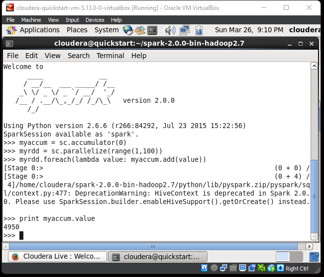

## Nama      : Muhammad Hamamiy Zadah
## Kelas     : TI - 3C
## No. Absen : 12

Menjalankan service dari pyspark terlebih dahulu dengan perintah
kemudian masuk pada directori spark2.0.0 dengan perintah

cd spark-2.0.0-bin-hadoop2.7

kemudian service dari pyspark dengan perintah

bin/pyspark

### Accumulator.py

Hasil : Berhasil. Fungsi accumulator (bertujuan akumulasi shared variable) berhasil dijalankan dengan output "4950".

### BroadCast.py

Hasil : Berhasil. Fungsi Broadcast (Membuat variabel broadcast) sesuai range dan untuk mengakses nilai matriks / array menggunakan atribut broadcastVar.value

### LogAnalytics.py

### PaiRDD.py

Hasil : Berhasil. fungsi dasar dari sebuah collection.

method maps digunakan untuk mapping sebuah collection

key: variabel myList 

value: jumlah huruf dari tiap" kata variabel myList
myPairRDD.collect(): print collection
myPairRDD.keys().collect(): print key pada collection
myPairRDD.values().collect(): print values pada collection

UnderstandingRDD.py

WordCount.py

SystemCommandsOutput.scala

SystemCommandsReturnCode.scale

